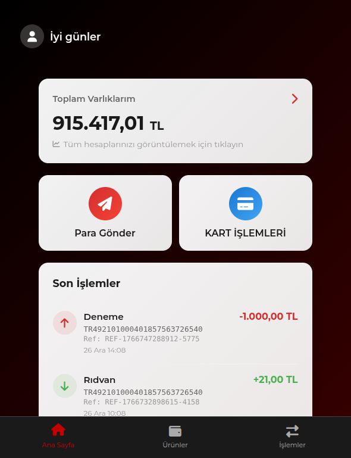
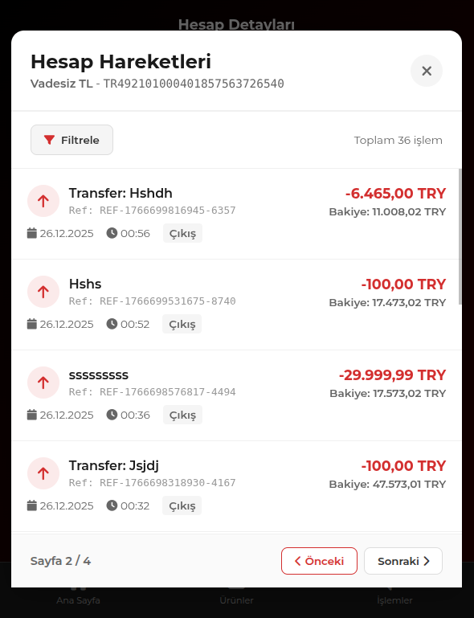
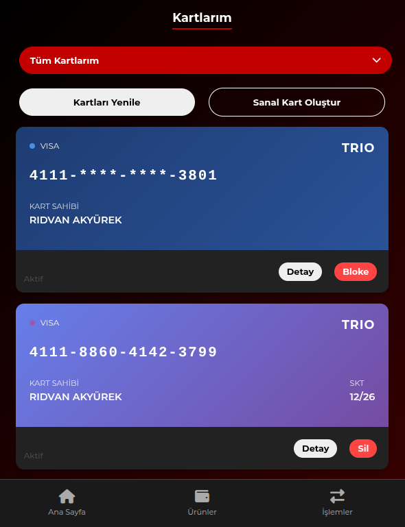
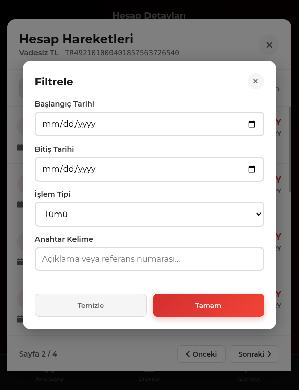
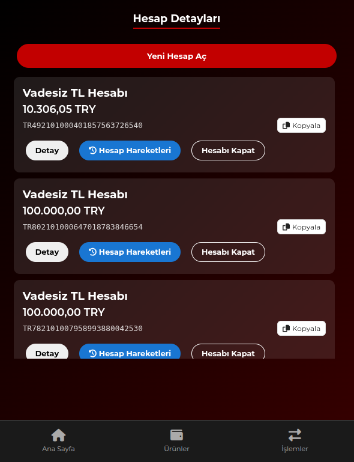
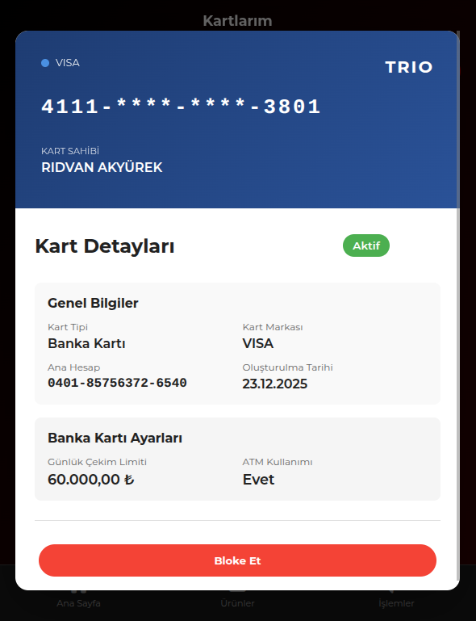
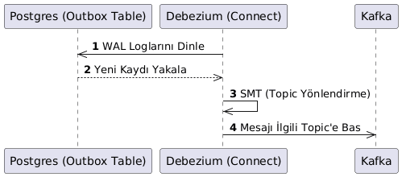
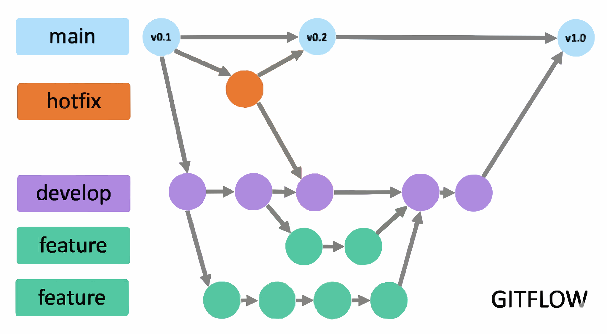

# 🏦 TrioBank - Mikroservis Bankacılık Platformu

**TrioBank**, yüksek ölçeklenebilirlik, veri tutarlılığı ve modern DevOps pratikleri ile tasarlanmış, **Kubernetes** üzerinde çalışan bir bankacılık simülasyonudur.

Bu proje sadece "çalışan bir uygulama" değil; **Event-Driven Architecture**, **Distributed Transactions (SAGA)** ve **GitOps** prensiplerinin canlı bir kanıtıdır.

---

### 🎥 Canlı Para Transferi
*İki farklı tarayıcıda açık olan hesaplar arasında anlık bakiye güncellemesi.*

https://github.com/user-attachments/assets/5d62292f-7124-4056-99ef-ffa0f46ba9a9
---

### 📸 Ekran Görüntüleri

| **Ana Ekran (Dashboard)** | **Hesap Hareketleri & Filtreleme** |
| :---: | :---: |
|  |  |
| *Kullanıcının varlık özeti ve hızlı işlemler* | *Detaylı işlem geçmişi ve anlık güncellemeler* |

| **Para Transferi** | **Kart Yönetimi** |
| :---: | :---: |
|  |  |
| *Validasyonlu ve güvenli transfer ekranı* | *Kredi ve banka kartı yönetim modülü* |

| **Hareket Filtreleme** | **Hesap Listesi** |
| :---: | :---: |
|  |  |
| *Geçmiş işlemleri detaylı filtreleme* | *Kullanıcının tüm hesaplarının listesi* |

| **Kart Detayları** |
| :---: |
|  |
| *Kart limit ve harcama detayları* |

---

## 🌟 Proje Özeti

TrioBank, geleneksel bankacılık monolitlerini yıkan, **Microservices** mimarisi üzerine kurulu bir platformdur. Kullanıcılar hesap açabilir, para transferi yapabilir, kredi kartı harcamalarını yönetebilir ve tüm bunları **anlık** olarak takip edebilir.

Ancak buzdağının görünen yüzünün altında çok ciddi bir mühendislik yatıyor. **Outbox Pattern** ile veri kaybı %0'a indirildi, **Debezium** ile veritabanı logları dinlenerek eventler üretildi ve **ArgoCD** ile tüm deployment süreçleri otomatize edildi.

---

## 🛠️ Teknoloji Yığını (Tech Stack)

Modern bulut teknolojilerinin en "baba"larını kullandık:

*   **Platform**: Kubernetes (AWS EKS & Local Kind Cluster)
*   **Diller**: Java (Spring Boot 3), Go (Golang)
*   **Veri Tabanları**: MSSQL (İlişkisel Veriler), MongoDB (Log & Doküman), Redis (Önbellek)
*   **Mesajlaşma**: Apache Kafka (Event Backbone)
*   **CDC & Streaming**: Debezium (Change Data Capture)
*   **Deployment**: ArgoCD (GitOps), Helm Charts
*   **Güvenlik**: HashiCorp Vault (Secret Management), JWT (Auth)

---

## Derinlemesine Mimari

Meraklısı için sistemin kaputunun altına iniyoruz. Burada "Hello World" seviyesinin çok ötesinde patternler uygulandı.

### 1. Mikroservis Mimarisi
Sistem, sorumlulukların net bir şekilde ayrıldığı 8 temel servisten oluşur:

*   **API Gateway (Go)**: Tüm trafiği karşılar, kimlik doğrulama (Auth) yapar ve ilgili servise yönlendirir.
*   **Ledger Service (Java)**: Sistemin kalbi. Double-entry bookkeeping (çift taraflı kayıt) mantığıyla çalışır. Paranın kaynağı ve hedefi asla şaşmaz.
*   **Transaction Service (Java)**: SAGA patternini yönetir. Bir transfer isteği geldiğinde Ledger, Account ve Card servislerini orkestra eder.
*   **Auth Service (Go)**: Güvenliğin bekçisi. JWT token üretimi ve doğrulaması yapar.

### 2. Transactional Outbox Pattern & CDC (Debezium)
Dağıtık sistemlerin en büyük sorunu **"Dual Write Duality"** (Veritabanına yazıp Kafka'ya yazamama) sorununu kökten çözdük.

1.  **Atomicity**: Servisler bir işlem yaptığında (örn: Para Transferi), kendi DB'lerine işlemi yazar ve AYNI TRANSACTION içinde `Outbox` tablosuna bir event kaydeder.
2.  **CDC (Debezium)**: Uygulama Kafka'ya mesaj atmaz! Debezium, veritabanının Transaction Log'larını (WAL) dinler.
3.  **Reliability**: `Outbox` tablosuna düşen her kayıt, Debezium tarafından yakalanır ve Kafka'ya basılır. Veri kaybı imkansızdır.
4.  **Consistency**: Servis çökse bile, DB rollback olursa event de oluşmaz. DB commit olursa event %100 oluşur.

### 3. GitOps & ArgoCD

*   Tüm Kubernetes manifestleri (Helm Chart'ları) Git reposunda tutulur.
*   **ArgoCD**, Git reposunu sürekli izler.
*   Bir değişiklik commitlendiğinde, ArgoCD bunu algılar ve Kubernetes cluster'ını Git'teki durumla (Desired State) eşitler.
*   Bu sayede altyapı da kod gibi versiyonlanır ve yönetilir.
