# TrioBank Veritabanı Dokümantasyonu

## İçindekiler

1. [Genel Proje Sunumu](#1-genel-proje-sunumu)
2. [Takım Yapısı ve İletişim](#2-takım-yapısı-ve-iletişim)
3. [Veri Kaynağı ve Kayıt Sayısı](#3-veri-kaynağı-ve-kayıt-sayısı)
4. [Fonksiyon ve Stored Procedures](#4-fonksiyon-ve-stored-procedures)
5. [Trigger'lar](#5-triggerlar)
6. [Job ve Yoğuk Alma (CDC Jobs)](#6-job-ve-yoğuk-alma-cdc-jobs)
7. [Rapor (Views)](#7-rapor-views)
8. [CDC ve Outbox Pattern](#8-cdc-ve-outbox-pattern)
9. [Kafka Integration](#9-kafka-integration)
10. [Servis Veritabanları Detayı](#10-servis-veritabanları-detayı)
11. [Entity Relationship Diagrams](#11-entity-relationship-diagrams)
12. [Performance Optimizasyonları](#12-performance-optimizasyonları)

---

## 1. Genel Proje Sunumu

### 1.1 Proje Özeti

**TrioBank**, modern mikroservis mimarisi kullanan, event-driven bir dijital bankacılık platformudur. Proje, Database-per-Service pattern'i kullanarak her mikroservisin kendi veritabanını yönetmesini sağlar.

**Temel Özellikler:**
- 🏦 Tam özellikli dijital bankacılık (hesap, kart, işlem yönetimi)
- 🔄 Event-driven mimari (Outbox Pattern + CDC)
- 📊 Double-entry accounting (çift kayıt muhasebe sistemi)
- 🔐 Güvenli ve ölçeklenebilir yapı
- ⚡ Real-time event processing (Kafka)

### 1.2 Teknoloji Stack

**Veritabanı Teknolojileri:**
- **SQL Server 2022**: Tüm mikroservislerin ana veritabanı
- **MongoDB 7.0**: Auth Service için NoSQL database
- **Redis 7.0**: Caching ve session yönetimi

**Event Streaming:**
- **Apache Kafka**: Event bus
- **Debezium**: Change Data Capture (CDC)
- **Kafka Connect**: Connector yönetimi

**Diğer Teknolojiler:**
- **Go**: Client ve diğer servisler
- **Spring Boot (Java)**: Account, Ledger, Transaction, Card servisleri
- **Kubernetes**: Container orkestra syonu

### 1.3 Mikroservis Veritabanı Stratejisi

TrioBank projesi **Database-per-Service** pattern'ini kullanır:


**Neden Database-per-Service?**

| Avantaj | Açıklama |
|---------|----------|
| **Bağımsız Deployment** | Her servis kendi database'ini bağımsız güncelleyebilir |
| **Teknoloji Özgürlüğü** | Her servis ihtiyacına göre farklı database kullanabilir |
| **Ölçeklenebilirlik** | Servislerin database'leri bağımsız scale edilebilir |
| **Fault Isolation** | Bir database'in çökmesi diğerlerini etkilemez |
| **Güvenlik** | Her servis sadece kendi verilerine erişebilir |

**Zorluklar ve Çözümler:**

| Zorluk | Çözüm |
|--------|-------|
| **Veri Tutarlılığı** | Saga Pattern ve Event-driven communication |
| **Distributed Transactions** | Outbox Pattern ile güvenilir event publishing |
| **Data Duplication** | CQRS pattern ve eventual consistency |
| **Joining Across Services** | API Composition ve materialized views |

---

## 2. Takım Yapısı ve İletişim

### 2.1 Proje Geliştirme Süreci

**Geliştirme Metodolojisi:** Agile/Scrum

**Teknoloji Kararları:**
- Mikroservis mimarisi tercihi: Scalability ve maintainability
- SQL Server seçimi: Enterprise düzey özellikler (CDC, transactions)
- Kafka seçimi: Event streaming için industry standard
- Outbox Pattern: Distributed transaction problemini çözme

### 2.2 Version Control

**Git Workflow:**
- **Branch Strategy**: GitFlow
- **Main Branch**: Production-ready kod
- **Develop Branch**: Integration branch
- **Feature Branches**: `feature/service-name/feature-description`

**Database Migration Stratejisi:**
- Backward-compatible migrations
- Rolling deployment desteği
- Automated migration tests

---

## 3. Veri Kaynağı ve Kayıt Sayısı

### 3.1 Veritabanı Listesi

| Database | Servis | Tablo Sayısı | Amaç |
|----------|--------|--------------|------|
| `auth_db` | Auth Service | 1 (MongoDB) | Kullanıcı authentication |
| `client_db` | Client Service | 1 | Müşteri bilgileri (KYC) |
| `account_db` | Account Service | 3 | Hesap yönetimi |
| `card_db` | Card Service | 1 | Kart yönetimi |
| `transaction_db` | Transaction Service | 1 | İşlem koordinasyonu |
| `ledger_db` | Ledger Service | 3 | Muhasebe ve bakiye |

### 3.2 Tablo Detayları

#### 3.2.1 Client Service (client_db)

**Tablolar:**
- `clients`: Müşteri bilgileri (KYC/profil)

**Kayıt Sayısı:** ~100,000 client

**Örnek Veri:**
```sql
SELECT TOP 3 
  id, first_name, last_name, tc_no, email, 
  status, created_at 
FROM clients;
```

#### 3.2.2 Account Service (account_db)

**Tablolar:**
- `product_definitions`: Hesap ürün katalağu
- `accounts`: Müşteri hesapları
- `outbox_events`: Event publishing için outbox

**Kayıt Sayısı:**
- Products: 1-5 ürün tanımı
- Accounts: ~100,000 hesap
- Outbox events: ~100,000+ event

**İlişkiler:**
```sql
-- Foreign Key
accounts.product_code → product_definitions.code
```

#### 3.2.3 Card Service (card_db)

**Tablolar:**
- `cards`: Tüm kart tipleri (Single Table Inheritance)
- `outbox_events`: Event publishing

**Kayıt Sayısı:**
- Cards: ~50,000 kart (DEBIT + VIRTUAL)
- Outbox events: ~50,000+ event

#### 3.2.4 Transaction Service (transaction_db)

**Tablolar:**
- `transactions`: İşlem koordinasyonu
- `outbox_events`: Event publishing

**Kayıt Sayısı:**
- Transactions: ~300,000 işlem
- Outbox events: ~300,000+ event

#### 3.2.5 Ledger Service (ledger_db)

**Tablolar:**
- `ledger_transactions`: İşlem header'ları
- `ledger_entries`: Muhasebe kayıtları (double-entry)
- `account_balances`: Bakiye cache
- `outbox_events`: Event publishing

**Kayıt Sayısı:**
- Ledger Transactions: ~300,000
- Ledger Entries: ~600,000 (her transaction için 2 entry)
- Account Balances: ~100,000
- Outbox events: ~600,000+ event

### 3.3 Veri İlişkileri

**Mikroservisler Arası İlişkiler (Loose Coupling):**

```sql
-- ❌ Mikroservisler arası FOREIGN KEY yok!
-- Bunun yerine eventual consistency ve events kullanılır

-- Client Service
clients.user_id  -- Auth Service'deki user ID'ye referans (FK YOK)

-- Account Service  
accounts.customer_id  -- Client Service'deki client ID'ye referans (FK YOK)

-- Ledger Service
account_balances.account_id  -- Account Service'deki account ID'ye referans (FK YOK)
ledger_entries.account_id    -- Account Service'deki account ID'ye referans (FK YOK)
```

**Neden Foreign Key Yok?**
- Mikroservisler bağımsız deploy edilebilmeli
- Database coupling önlenmeli
- Eventual consistency yeterli

---

## 4. Fonksiyon ve Stored Procedures

### 4.1 Account Service

#### 4.1.1 Scalar Functions

**`fn_calculate_account_balance`**
- **Amaç**: Gerçek zamanlı bakiye hesaplama (ledger entries'den)
- **Parametreler**: `@account_id NVARCHAR(50)`
- **Dönüş**: `DECIMAL(19,4)`

```sql
CREATE FUNCTION dbo.fn_calculate_account_balance(@account_id NVARCHAR(50))
RETURNS DECIMAL(19,4)
AS
BEGIN
    -- Implementation will be added
    RETURN 0.0;
END
```

#### 4.1.2 Table-Valued Functions

**`fn_get_customer_accounts`**
- **Amaç**: Müşterinin tüm hesaplarını getirir
- **Parametreler**: `@customer_id NVARCHAR(50)`
- **Dönüş**: Table

```sql
CREATE FUNCTION dbo.fn_get_customer_accounts(@customer_id NVARCHAR(50))
RETURNS TABLE
AS
RETURN
(
    -- Implementation will be added
    SELECT * FROM accounts WHERE customer_id = @customer_id
);
```

#### 4.1.3 Stored Procedures

**`sp_create_account_with_validation`**
- **Amaç**: İş kurallarıyla hesap oluşturma
- **Parametreler**: Customer ID, Product Code, Currency, vs.
- **İş Kuralları**:
  - Customer aktif olmalı
  - Product mevcut ve aktif olmalı
  - Aynı currency'den max 3 hesap
- **Event**: AccountCreated event'i outbox'a yazar

**`sp_close_account`**
- **Amaç**: Hesap kapatma (bakiye kontrolü ile)
- **İş Kuralları**:
  - Bakiye 0 olmalı
  - Bekleyen işlem olmamalı
- **Event**: AccountClosed event'i outbox'a yazar

### 4.2 Ledger Service

**`sp_post_transaction`**
- **Amaç**: Double-entry transaction oluşturma
- **İş Kuralları**:
  - DEBIT total = CREDIT total
  - Tüm entries atomik
- **Transaction**: BEGIN TRAN / COMMIT / ROLLBACK

**`sp_reverse_transaction`**
- **Amaç**: İşlem iptal (reversal)
- **Mantık**: Ters kayıt oluşturur
- **Event**: TransactionReversed event

---

## 5. Trigger'lar

### 5.1 Audit Triggers

**Account Service - `tr_accounts_audit_log`**
```sql
-- Hesap değişikliklerini audit tablosuna kaydeder
-- Trigger Type: AFTER UPDATE
-- Table: accounts
-- Actions: Status değişiklikleri, balance güncellemeleri
```

### 5.2 Validation Triggers

**Transaction Service - `tr_validate_transaction_amount`**
```sql
-- İşlem tutarı doğrulama
-- Trigger Type: INSTEAD OF INSERT
-- Business Rules:
--   - Amount > 0
--   - Amount <= daily limit
--   - Currency geçerli
```

### 5.3 Business Rule Triggers

**Ledger Service - `tr_validate_double_entry`**
```sql
-- Çift kayıt muhasebe doğrulama
-- Trigger Type: AFTER INSERT ON ledger_entries
-- Validation: SUM(DEBIT) = SUM(CREDIT) per transaction
```

**Ledger Service - `tr_ledger_entry_immutable`**
```sql
-- Entry'lerin değiştirilmesini engelleyen trigger
-- Trigger Type: INSTEAD OF UPDATE/DELETE
-- Action: RAISERROR - Ledger entries are immutable
```

---

## 6. Job ve Yoğuk Alma (CDC Jobs)

### 6.1 SQL Server CDC Jobs

Her veritabanında CDC aktif edildiğinde SQL Server otomatik olarak 2 job oluşturur:

#### 6.1.1 CDC Capture Job

**Job Adı:** `cdc.{database_name}_capture`

**Amaç:** Transaction log'dan değişiklikleri yakalayıp CDC tablolarına yazar

**Çalışma Sıklığı:** Sürekli (continuous)

**Örnek:**
```sql
-- Account DB için
Job Name: cdc.account_db_capture

-- İzlenen Tablo
Table: dbo.outbox_events

-- CDC Tablosu  
CDC Table: cdc.dbo_outbox_events_CT
```

**Nasıl Çalışır:**
1. Transaction log'u okur
2. INSERT/UPDATE operations yakalar
3. `cdc.dbo_outbox_events_CT` tablosuna yazar
4. LSN (Log Sequence Number) kaydeder

#### 6.1.2 CDC Cleanup Job

**Job Adı:** `cdc.{database_name}_cleanup`

**Amaç:** Eski CDC kayıtlarını temizler (retention policy)

**Çalışma Sıklığı:** Günde 1 kez (varsayılan 2:00 AM)

**Retention:** 3 gün (varsayılan)

**Sorgu:**
```sql
-- CDC job'larını görüntüleme
SELECT 
    name, 
    enabled, 
    description,
    date_created
FROM msdb.dbo.sysjobs
WHERE name LIKE 'cdc.%'
ORDER BY name;
```

### 6.2 Debezium Connector (Kafka Connect)

**Connector Tipi:** SQL Server Source Connector

**Çalışma Mantığı:**


**Connector Konfigürasyonu:**
```yaml
apiVersion: kafka.strimzi.io/v1beta2
kind: KafkaConnector
metadata:
  name: account-cdc-connector
spec:
  class: io.debezium.connector.sqlserver.SqlServerConnector
  tasksMax: 1
  config:
    database.hostname: account-mssql.triobank
    database.port: "1433"
    database.names: "account_db"
    table.include.list: "dbo.outbox_events"
    
    # Outbox Event Router Transform
    transforms: "outbox"
    transforms.outbox.type: "io.debezium.transforms.outbox.EventRouter"
    transforms.outbox.route.by.field: "aggregate_type"
    transforms.outbox.route.topic.replacement: "account.${routedByValue}.v1"
```

**Monitoring:**
```bash
# Connector status
kubectl get kafkaconnector -n triobank

# Connector logs
kubectl logs -n triobank deployment/connect -f | grep account-cdc
```

### 6.3 Outbox Pattern Cleanup (Opsiyonel)

**Job Adı:** `OutboxEventCleanup` (gelecekte eklenebilir)

**Amaç:** Debezium tarafından işlenmiş eski outbox kayıtlarını siler

**Pseudocode:**
```sql
-- 7 günden eski, işlenmiş event'leri sil
DELETE FROM outbox_events
WHERE created_at < DATEADD(day, -7, GETUTCDATE())
  AND id NOT IN (
    -- Debezium'ın henüz işlemediği event'ler
    SELECT event_id FROM debezium_offset_storage
  );
```

**Not:** Şu an bu job yok, event'ler süresiz saklanıyor.

---

## 7. Rapor (Views)

### 7.1 Operasyonel Raporlar

#### 7.1.1 Günlük İşlem Özeti (Transaction Service)

**View: `v_daily_transaction_summary`**

**Amaç:** Günlük işlem istatistikleri

```sql
CREATE VIEW v_daily_transaction_summary AS
SELECT 
    CAST(created_at AS DATE) as transaction_date,
    status,
    COUNT(*) as transaction_count,
    SUM(amount) as total_amount,
    AVG(amount) as avg_amount,
    MIN(amount) as min_amount,
    MAX(amount) as max_amount
FROM transactions
GROUP BY CAST(created_at AS DATE), status;
```

**Kullanım:**
```sql
-- Bugünkü özet
SELECT * FROM v_daily_transaction_summary
WHERE transaction_date = CAST(GETUTCDATE() AS DATE);
```

#### 7.1.2 Hesap Özeti Raporu (Account Service)

**View: `v_customer_account_summary`**

```sql
CREATE VIEW v_customer_account_summary AS
SELECT 
    a.customer_id,
    COUNT(*) as total_accounts,
    SUM(CASE WHEN a.status = 'ACTIVE' THEN 1 ELSE 0 END) as active_accounts,
    SUM(CASE WHEN a.status = 'CLOSED' THEN 1 ELSE 0 END) as closed_accounts,
    SUM(a.balance) as total_balance,
    STRING_AGG(a.currency, ', ') as currencies
FROM accounts a
GROUP BY a.customer_id;
```

### 7.2 Mali Raporlar

#### 7.2.1 Mizan Raporu (Ledger Service)

**View: `v_trial_balance`**

**Amaç:** Accounting trial balance (mizan)

```sql
CREATE VIEW v_trial_balance AS
SELECT 
    account_id,
    SUM(CASE WHEN entry_type = 'DEBIT' THEN amount ELSE 0 END) as total_debit,
    SUM(CASE WHEN entry_type = 'CREDIT' THEN amount ELSE 0 END) as total_credit,
    SUM(CASE WHEN entry_type = 'CREDIT' THEN amount ELSE -amount END) as net_balance
FROM ledger_entries
WHERE status = 'POSTED'
GROUP BY account_id;
```

#### 7.2.2 Hesap Ekstresi (Ledger Service)

**View: `v_account_statement`**

```sql
CREATE VIEW v_account_statement AS
SELECT 
    le.account_id,
    le.created_at as entry_date,
    lt.transaction_type,
    le.entry_type,
    le.amount,
    le.description,
    le.reference_number,
    -- Running balance hesaplama window function ile
    SUM(CASE WHEN le.entry_type = 'CREDIT' THEN le.amount ELSE -le.amount END) 
        OVER (PARTITION BY le.account_id ORDER BY le.created_at) as running_balance
FROM ledger_entries le
JOIN ledger_transactions lt ON le.transaction_id = lt.transaction_id
WHERE le.status = 'POSTED';
```

### 7.3 Yönetim Raporları

#### 7.3.1 Ürün Bazında Hesap Dağılımı (Account Service)

**View: `v_active_accounts_by_product`**

```sql
CREATE VIEW v_active_accounts_by_product AS
SELECT 
    p.code as product_code,
    p.name as product_name,
    p.category,
    COUNT(a.id) as account_count,
    SUM(a.balance) as total_balance,
    AVG(a.balance) as avg_balance
FROM product_definitions p
LEFT JOIN accounts a ON p.code = a.product_code AND a.status = 'ACTIVE'
GROUP BY p.code, p.name, p.category;
```

### 7.4 Compliance Raporları

#### 7.4.1 Süresi Dolan Kartlar (Card Service)

**View: `v_expiring_cards`**

```sql
CREATE VIEW v_expiring_cards AS
SELECT 
    id,
    card_type,
    masked_number,
    cardholder_name,
    expiry_month,
    expiry_year,
    status,
    account_id,
    DATEFROMPARTS(expiry_year, expiry_month, 1) as expiry_date,
    DATEDIFF(month, GETUTCDATE(), DATEFROMPARTS(expiry_year, expiry_month, 1)) as months_until_expiry
FROM cards
WHERE status = 'ACTIVE'
  AND DATEDIFF(month, GETUTCDATE(), DATEFROMPARTS(expiry_year, expiry_month, 1)) BETWEEN 0 AND 3;
```

**Kullanım Senaryosu:** Kart yenileme kampanyaları

---

## 8. CDC ve Outbox Pattern

### 8.1 Change Data Capture (CDC) Nedir?

**CDC (Change Data Capture)**, veritabanındaki değişiklikleri (INSERT, UPDATE, DELETE) yakalayan bir mekanizmadır.

**SQL Server CDC Mimarisi:**


**CDC Avantajları:**
- ✅ **Düşük Impact:** Transaction log'u okur, tablo'ya dokunmaz
- ✅ **Guaranteed Delivery:** Log-based, data loss riski yok
- ✅ **Asynchronous:** Uygulamayı yavaşlatmaz
- ✅ **Historical Tracking:** Değişiklik geçmiş i saklanır

### 8.2 Outbox Pattern

**Outbox Pattern**, distributed transaction problemini çözen bir event publishing Pattern'idir.

**Problem: Dual Write**
```java
// ❌ YANLIŞ - Atomic değil!
accountRepository.save(account);  // DB write
kafkaTemplate.send("topic", event); // Kafka write

// İki durumda problem:
// 1. DB başarılı, Kafka fail → Event kaybı
// 2. Kafka başarılı, DB fail → Phantom event
```

**Çözüm: Outbox Pattern**
```java
// ✅ DOĞRU - Tek transaction
@Transactional
public void createAccount(Account account) {
    // 1. Account'u kaydet
    accountRepository.save(account);
    
    // 2. Event'i AYNI transaction'da outbox'a yaz
    OutboxEvent event = new OutboxEvent(
        aggregateType: "Account",
        aggregateId: account.getId(),
        type: "AccountCreated",
        payload: toJson(account)
    );
    outboxRepository.save(event);
    
    // Transaction commit → Her ikisi de kaydedilir VEYA hiçbiri
}

// 3. Debezium event'i CDC ile okuyup Kafka'ya gönderir
```

### 8.3 Event Flow Diyagramı


### 8.4 Outbox Tablosu Yapısı

```sql
CREATE TABLE dbo.outbox_events (
    id UNIQUEIDENTIFIER PRIMARY KEY DEFAULT NEWID(),
    aggregate_type NVARCHAR(255) NOT NULL,  -- "Account", "Transaction", etc.
    aggregate_id NVARCHAR(255) NOT NULL,     -- Entity ID
    type NVARCHAR(255) NOT NULL,             -- Event type: "AccountCreated"
    payload NVARCHAR(MAX) NOT NULL,          -- JSON event data
    created_at DATETIME2 DEFAULT SYSDATETIME(),
    
    INDEX IX_outbox_events_created_at (created_at),
    INDEX IX_outbox_events_aggregate_type (aggregate_type)
);
```

**Örnek Kayıt:**
```sql
INSERT INTO outbox_events VALUES (
    NEWID(),
    'Account',                    -- aggregate_type
    'cc9610aa-6f26-4f73-836d',   -- aggregate_id (account ID)
    'AccountCreated',             -- type
    '{                            -- payload (JSON)
        "accountId": "cc9610aa-6f26-4f73-836d",
        "customerId": "22b273da-6217-4fb8",
        "accountNumber": "TR482101009945699819533871",
        "accountType": "CHECKING",
        "currency": "TRY",
        "status": "ACTIVE",
        "createdBy": "SYSTEM",
        "createdAt": "2025-12-24T11:23:08.501Z"
    }',
    SYSDATETIME()
);
```

### 8.5 CDC Kurulumu

**Database Level:**
```sql
-- 1. CDC'yi database seviyesinde aktifleştir
USE account_db;
EXEC sys.sp_cdc_enable_db;

-- 2. Kontrol et
SELECT name, is_cdc_enabled 
FROM sys.databases 
WHERE name = 'account_db';
```

**Table Level:**
```sql
-- 3. Outbox tablosu için CDC aktifleştir
EXEC sys.sp_cdc_enable_table
    @source_schema = N'dbo',
    @source_name = N'outbox_events',
    @role_name = NULL,
    @supports_net_changes = 0;

-- 4. Kontrol et
SELECT name, is_tracked_by_cdc  
FROM sys.tables
WHERE name = 'outbox_events';
```

**CDC Tablolarını Görüntüleme:**
```sql
-- CDC capture instance
SELECT * FROM cdc.change_tables;

-- CDC table'daki kayıtlar
SELECT * FROM cdc.dbo_outbox_events_CT
ORDER BY __$start_lsn DESC;
```

---

## 9. Kafka Integration

### 9.1 Topic Naming Convention

TrioBank projesi **semantic topic naming** kullanır:

**Format:** `{service}.{aggregate}.{version}`

**Örnekler:**
- `account.Account.v1` - Account Service'den Account event'leri
- `ledger.BalanceUpdated.v1` - Ledger Service'den balance event'leri
- `transaction.TransactionStarted.v1` - Transaction event'leri

**Neden Bu Format?**
- Servis bazında topic isolation
- Aggregate bazında routing
- Versioning desteği (v1, v2 parallel çalışabilir)

### 9.2 Debezium EventRouter Transform

**EventRouter**, outbox tablosundaki generic kayıtları anlamlı Kafka event'lerine dönüştürür.

**Outbox Kaydı:**
```json
{
  "id": "550e8400-e29b-41d4-a716-446655440000",
  "aggregate_type": "Account",
  "aggregate_id": "cc9610aa-6f26-4f73-836d",
  "type": "AccountCreated",
  "payload": "{\"accountId\":\"cc9610aa\",\"currency\":\"TRY\",...}",
  "created_at": "2025-12-24T11:23:08.501Z"
}
```

**Kafka Event (EventRouter sonrası):**
```yaml
Topic: account.Account.v1
Key: cc9610aa-6f26-4f73-836d  # aggregate_id
Headers:
  - eventType: AccountCreated   # type
Value: {                         # payload (parsed JSON)
  "accountId": "cc9610aa-6f26-4f73-836d",
  "customerId": "22b273da-6217-4fb8",
  "currency": "TRY",
  "status": "ACTIVE"
}
```

**Transform Konfigürasyonu:**
```yaml
transforms: "outbox"
transforms.outbox.type: "io.debezium.transforms.outbox.EventRouter"
transforms.outbox.route.by.field: "aggregate_type"
transforms.outbox.route.topic.replacement: "account.${routedByValue}.v1"
transforms.outbox.table.field.event.id: "id"
transforms.outbox.table.field.event.key: "aggregate_id"
transforms.outbox.table.field.event.type: "type"
transforms.outbox.table.field.event.payload: "payload"
transforms.outbox.table.field.event.timestamp: "created_at"
transforms.outbox.table.expand.json.payload: "true"
```

### 9.3 Event Flow Örnekleri

#### 9.3.1 Account Created Flow

```mermaid
sequenceDiagram
    participant Client as Client Service
    participant Account as Account Service
    participant Kafka as Kafka
    participant Ledger as Ledger Service
    
    Client->>Account: POST /accounts (UserCreated event)
    Account->>Account: Create Account + Outbox Event
    Note over Account: Transaction commits
    
    Account-->>Kafka: CDC → AccountCreated event
    Kafka->>Ledger: Consume AccountCreated
    Ledger->>Ledger: Create account_balance (initial: 0)
    Ledger-->>Kafka: BalanceInitialized event
    
    Kafka->>Account: Consume BalanceInitialized
    Account->>Account: Mark account as READY
```



#### 9.3.2 Transaction Flow (Saga Pattern)


---

## 10. Servis Veritabanları Detayı

### 10.1 Account Service Database (account_db)

#### 10.1.1 Tablolar

**1. product_definitions**
- **Amaç:** Hesap ürün kataloğu
- **Primary Key:** `code` (NVARCHAR(50))
- **Kayıt Sayısı:** 1-5 ürün

**Kolonlar:**
| Column | Type | Description |
|--------|------|-------------|
| code | NVARCHAR(50) | PK - Ürün kodu (CHECKING_TRY) |
| name | NVARCHAR(100) | Ürün adı |
| category | NVARCHAR(50) | CHECKING, SAVINGS, CREDIT |
| features | NVARCHAR(MAX) | JSON - Ürün özellikleri |
| is_active | BIT | Aktif mi? |
| created_at | DATETIME2 | Oluşturma zamanı |

**Indexes:**
- `IX_product_definitions_category`
- `IX_product_definitions_active`

**2. accounts**
- **Amaç:** Müşteri hesapları
- **Primary Key:** `id` (NVARCHAR(36) - GUID)
- **Kayıt Sayısı:** ~100,000

**Kolonlar:**
| Column | Type | Constraints | Description |
|--------|------|-------------|-------------|
| id | NVARCHAR(36) | PK | Account ID (GUID) |
| customer_id | NVARCHAR(50) | NOT NULL | Client ID (FK yok!) |
| account_number | NVARCHAR(50) | UNIQUE | IBAN |
| product_code | NVARCHAR(50) | FK → product_definitions | Ürün tipi |
| currency | NVARCHAR(3) | DEFAULT 'TRY' | Para birimi |
| balance | DECIMAL(19,4) | DEFAULT 0 | Bakiye (projection) |
| status | NVARCHAR(20) | | ACTIVE, CLOSED, FROZEN |
| configurations | NVARCHAR(MAX) | | JSON settings |
| version | BIGINT | DEFAULT 0 | Optimistic locking |
| created_at | DATETIME2 | NOT NULL | |
| updated_at | DATETIMEOFFSET | | |

**Constraints:**
```sql
-- Foreign Key
ALTER TABLE accounts ADD CONSTRAINT FK_accounts_product
FOREIGN KEY (product_code) REFERENCES product_definitions(code);

-- Unique
ALTER TABLE accounts ADD CONSTRAINT UQ_accounts_number 
UNIQUE (account_number);
```

**Indexes:**
```sql
CREATE INDEX IX_accounts_customer_id ON accounts(customer_id);
CREATE INDEX IX_accounts_product_code ON accounts(product_code);
CREATE INDEX IX_accounts_status ON accounts(status);
CREATE INDEX IX_accounts_customer_status ON accounts(customer_id, status);
```

**3. outbox_events**
- **Amaç:** Event publishing (CDC için)
- **Primary Key:** `id` (UNIQUEIDENTIFIER)
- **Kayıt Sayısı:** ~100,000+

#### 10.1.2 Entity Relationship


### 10.2 Ledger Service Database (ledger_db)

#### 10.2.1 Çift Kayıt Muhasebe Sistemi

Ledger Service, **double-entry accounting** prensibini uygular.

**Temel Prensipler:**
1. Her transaction en az 2 entry içerir (DEBIT + CREDIT)
2. `SUM(DEBIT) = SUM(CREDIT)` her transaction için
3. Entry'ler immutable (değiştirilemez)
4. Reversal ile iptal edilir

#### 10.2.2 Tablolar

**1. ledger_transactions**
- **Amaç:** Transaction header'ları
- **Primary Key:** `transaction_id` (NVARCHAR(100))
- **Kayıt Sayısı:** ~300,000

**Kolonlar:**
| Column | Type | Description |
|--------|------|-------------|
| transaction_id | NVARCHAR(100) | PK - Business key |
| transaction_type | NVARCHAR(50) | TRANSFER, DEPOSIT, etc. |
| transaction_date | DATETIME2 | Technical timestamp |
| posting_date | DATE | Accounting date |
| value_date | DATE | Value date |
| total_amount | DECIMAL(19,4) | Transaction amount |
| currency | NVARCHAR(3) | Currency
 code |
| status | NVARCHAR(20) | POSTED, REVERSED |
| description | NVARCHAR(500) | Description |
| is_reversal | BIT | Is this a reversal? |
| original_transaction_id | NVARCHAR(100) | If reversal |
| created_at | DATETIME2 | |

**2. ledger_entries**
- **Amaç:** Muhasebe kayıtları (double-entry)
- **Primary Key:** `id` (UNIQUEIDENTIFIER)
- **Kayıt Sayısı:** ~600,000 (her transaction için 2 entry)

**Kolonlar:**
| Column | Type | Constraint | Description |
|--------|------|-----------|-------------|
| id | UNIQUEIDENTIFIER | PK | Entry ID |
| transaction_id | NVARCHAR(100) | FK | Transaction reference |
| entry_sequence | INT | | Order in transaction |
| account_id | NVARCHAR(50) | | Account reference (no FK!) |
| entry_type | NVARCHAR(10) | CHECK | DEBIT or CREDIT |
| amount | DECIMAL(19,4) | CHECK > 0 | Always positive |
| currency | NVARCHAR(3) | | Currency code |
| description | NVARCHAR(500) | | Entry description |
| status | NVARCHAR(20) | DEFAULT 'POSTED' | Always POSTED |
| posting_date | DATE | | Accounting date |
| created_at | DATETIME2 | | |

**Constraints:**
```sql
ALTER TABLE ledger_entries ADD CONSTRAINT FK_ledger_entries_transaction
FOREIGN KEY (transaction_id) REFERENCES ledger_transactions(transaction_id)
ON DELETE CASCADE;

ALTER TABLE ledger_entries ADD CONSTRAINT CK_entry_type
CHECK (entry_type IN ('DEBIT', 'CREDIT'));

ALTER TABLE ledger_entries ADD CONSTRAINT CK_amount_positive
CHECK (amount > 0);
```

**3. account_balances**
- **Amaç:** Bakiye cache (performance optimization)
- **Primary Key:** `account_id` (NVARCHAR(50))
- **Kayıt Sayısı:** ~100,000

**Kolonlar:**
| Column | Type | Description |
|--------|------|-------------|
| account_id | NVARCHAR(50) | PK |
| balance | DECIMAL(19,4) | Current balance |
| blocked_amount | DECIMAL(19,4) | Pending transactions |
| currency | NVARCHAR(3) | Currency code |
| last_entry_id | UNIQUEIDENTIFIER | Audit trail |
| last_updated_at | DATETIME2 | Last update time |
| version | BIGINT | Optimistic locking |

**Computed:**
```sql
-- available_balance = balance - blocked_amount
```

#### 10.2.3 Double-Entry Örnek

**Transfer: Account A → Account B (1000 TRY)**

**ledger_transactions:**
```sql
INSERT INTO ledger_transactions VALUES (
    'TXN-2025-001',        -- transaction_id
    'TRANSFER',            -- transaction_type
    '2025-12-24 10:00',    -- transaction_date
    '2025-12-24',          -- posting_date
    '2025-12-24',          -- value_date
    1000.00,               -- total_amount
    'TRY',                 -- currency
    'POSTED',              -- status
    'Transfer from A to B' -- description
);
```

**ledger_entries:**
```sql
-- Entry 1: DEBIT Account A (1000 TRY çıkışı)
INSERT INTO ledger_entries VALUES (
    NEWID(),               -- id
    'TXN-2025-001',        -- transaction_id
    1,                     -- entry_sequence
    'ACC-A',               -- account_id
    'DEBIT',               -- entry_type
    1000.00,               -- amount
    'TRY',                 -- currency
    '2025-12-24'           -- posting_date
);

-- Entry 2: CREDIT Account B (1000 TRY girişi)
INSERT INTO ledger_entries VALUES (
    NEWID(),               -- id
    'TXN-2025-001',        -- transaction_id
    2,                     -- entry_sequence
    'ACC-B',               -- account_id
    'CREDIT',              -- entry_type
    1000.00,               -- amount
    'TRY',                 -- currency
    '2025-12-24'           -- posting_date
);
```

**Validation:**
```sql
-- DEBIT = CREDIT kontrolü
SELECT transaction_id,
    SUM(CASE WHEN entry_type = 'DEBIT' THEN amount ELSE 0 END) as total_debit,
    SUM(CASE WHEN entry_type = 'CREDIT' THEN amount ELSE 0 END) as total_credit
FROM ledger_entries
WHERE transaction_id = 'TXN-2025-001'
GROUP BY transaction_id;

-- Result: total_debit = total_credit = 1000.00 ✓
```

---

## 11. Entity Relationship Diagrams

### 11.1 Mikroservis Genel Diyagram


### 11.2 CDC ve Event Flow


---

## 12. Performance Optimizasyonları

### 12.1 Index Stratejileri

#### 12.1.1 Composite Index Kullanımı

**Örnek:** Customer'ın aktif hesaplarını bulma
```sql
-- Sık kullanılan query
SELECT * FROM accounts 
WHERE customer_id = @customer_id 
  AND status = 'ACTIVE';

-- Optimum index
CREATE INDEX IX_accounts_customer_status 
ON accounts(customer_id, status)
INCLUDE (account_number, balance);
```

**Neden Composite?**
- WHERE clause'daki her iki kolon da indexed
- INCLUDE ile diğer kolonlar index'e eklenir (covering index)
- No table lookup needed!

#### 12.1.2 Index Maintenance

**Düzenli İzleme:**
```sql
-- Index fragmentation
SELECT 
    OBJECT_NAME(ips.object_id) AS TableName,
    i.name AS IndexName,
    ips.avg_fragmentation_in_percent
FROM sys.dm_db_index_physical_stats(
    DB_ID(), NULL, NULL, NULL, 'LIMITED') ips
JOIN sys.indexes i ON ips.object_id = i.object_id 
    AND ips.index_id = i.index_id
WHERE ips.avg_fragmentation_in_percent > 10
ORDER BY ips.avg_fragmentation_in_percent DESC;
```

**Rebuild Strategy:**
```sql
-- Fragmentation > 30% → REBUILD
ALTER INDEX IX_accounts_customer_status ON accounts REBUILD;

-- Fragmentation 10-30% → REORGANIZE
ALTER INDEX IX_accounts_customer_status ON accounts REORGANIZE;
```

### 12.2 Optimistic Locking

**Problem:** Concurrent updates on same account

**Çözüm:** Version column
```sql
-- accounts.version kullanımı
UPDATE accounts
SET balance = @new_balance,
    version = version + 1,
    updated_at = GETUTCDATE()
WHERE id = @account_id
  AND version = @expected_version;  -- Optimistic lock check

-- affected_rows = 0 ise conflict var!
IF @@ROWCOUNT = 0
    RAISERROR('Concurrent modification detected', 16, 1);
```

### 12.3 Connection Pooling

**Uygulama Seviyesi:**
```java
// Spring Boot - application.yaml
spring:
  datasource:
    hikari:
      maximum-pool-size: 20
      minimum-idle: 5
      connection-timeout: 30000
      idle-timeout: 600000
      max-lifetime: 1800000
```

**Veritabanı Seviyesi:**
```sql
-- Max connections ayarı
ALTER SERVER CONFIGURATION
SET PROCESS AFFINITY CPU = AUTO;

-- Resource Governor kullanımı
-- (Production'da resource pool tanımla)
```

### 12.4 Query Optimization

#### 12.4.1 Pagination

**❌ Yanlış:**
```sql
-- OFFSET kullanmak yavaş (tüm satırları skip eder)
SELECT * FROM transactions
ORDER BY created_at DESC
OFFSET 10000 ROWS FETCH NEXT 100 ROWS ONLY;
```

**✅ Doğru:**
```sql
-- Keyset pagination (seek method)
SELECT * FROM transactions
WHERE created_at < @last_seen_timestamp
ORDER BY created_at DESC
FETCH FIRST 100 ROWS ONLY;
```

#### 12.4.2 Subquery vs JOIN

**❌ Yanlış:**
```sql
-- Correlated subquery - slow!
SELECT a.*,
    (SELECT SUM(balance) FROM account_balances ab 
     WHERE ab.account_id = a.id) as ledger_balance
FROM accounts a;
```

**✅ Doğru:**
```sql
-- JOIN - much faster
SELECT a.*, ab.balance as ledger_balance
FROM accounts a
LEFT JOIN account_balances ab ON a.id = ab.account_id;
```

### 12.5 CDC Performance Tuning

**Debezium Connector Optimization:**
```yaml
# poll.interval.ms: CDC table'ı ne sıklıkla kontrol eder
poll.interval.ms: "500"  # Default: 500ms (iyi balance)

# max.batch.size: Tek seferde kaç event alır
max.batch.size: "2048"   # Default: 2048 (yeterli)

# snapshot.mode: İlk başlatmada tüm verileri mi alsın?
snapshot.mode: "initial"  # Sadece ilk defa, sonra incremental
```

**CDC Retention:**
```sql
-- CDC retention period (varsayılan 3 gün)
EXEC sys.sp_cdc_change_job 
    @job_type = N'cleanup',
    @retention = 4320;  -- 3 gün (dakika cinsinden)
```

---

## 🎯 Özet

Bu dokümantasyon, TrioBank projesinin veritabanı mimarisini detaylı şekilde açıklamaktadır:

**Temel Konular:**
1. ✅ **Mikroservis Mimarisi:** Database-per-Service pattern
2. ✅ **CDC & Outbox Pattern:** Güvenilir event publishing
3. ✅ **Kafka Integration:** Event-driven communication
4. ✅ **Double-Entry Accounting:** Ledger servisi
5. ✅ **Performance:** Indexing, locking, query optimization

**Veritabanı İstatistikleri:**
- **Toplam DB:** 6 database (5 SQL Server + 1 MongoDB)
- **Toplam Tablo:** ~15 tablo
- **Toplam Kayıt:** ~1,000,000+ kayıt (100K client scenario)
- **CDC Jobs:** 5 capture + 5 cleanup job
- **Outbox Events:** ~1,000,000+ event

---

**Son Güncelleme:** 24 Aralık 2025
**Versiyon:** 1.0.0
**Proje:** TrioBank Mikroservis Platformu
